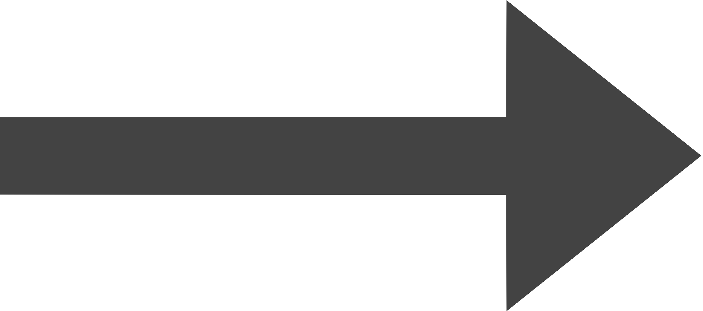

## Crafting Recipes
<label for="searchBar"> Search: <input name="searchBar" id="searchBar" placeholder="Enter item name here"></label>

<table>
    <tbody id="bruh">
    <tr>
        <th>Item</th>
        <th colspan="3">Recipe </th>
        <th colspan="3"></th>
        <th>Output</th>
    </tr>
    </tbody>
</table>

